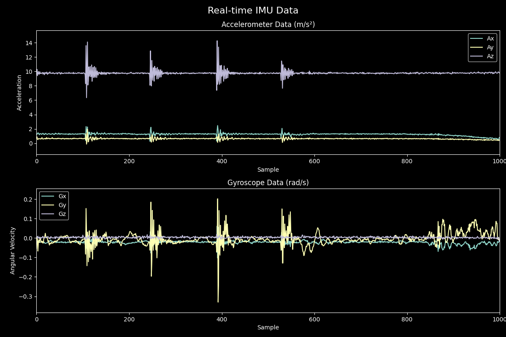

# IMU Badminton Data Collection System
Complete hardware and software solution for capturing badminton stroke data using IMU sensors. This repository contains everything needed to build the data collection system and generate the dataset.

## 🏸 Overview
The system consists of an ESP32-based sensor device that wirelessly transmits real-time IMU data to a Python server for processing, visualizaing and storage.


## 🏗️ System Architecture


## ⚡ Hardware Components
- **ESP32 DevKit** - Main microcontroller with WiFi capability
- **MPU6050 IMU Sensor** - 6-axis accelerometer and gyroscope
- **Custom 3D-printed mount** - Secure attachment to badminton racket
- **Li-Po battery** - Portable power solution
- **LED indicators** - System status feedback

## 💻 Software Components

### Firmware (C++ with PlatformIO)
- Real-time IMU data acquisition at 100Hz
- WiFi connection management with auto-reconnect
- WebSocket-based data transmission
- Error handling and status reporting

### Server (Python)
- WebSocket server for real-time data reception
- JSON-based data storage with timestamps
- Session management for data collection
- Real-time data validation and quality control
- Web interface for monitoring collection status

## Real-time Visualization


## 📊 Data Format
```json
{
"metadata": {
    "timestamp": ,
    "total_frame": ,
    "duration_seconds": ,
    "sampling_rate": ,
    "session_name": ,
            },
"data": {
    "Ax": [],
    "Ay": [],
    "Az": [],
    "Gx": [],
    "Gy": [],
    "Gz": []
}
}
```

## 📄 Dataset Usage
The collected dataset is available in [Badminton Stroke Classifier](https://github.com/yourusername/badminton-stroke-classifier) and can be used independently for machine learning research.

**Related Project**: [Badminton Stroke Classifier](https://github.com/yourusername/badminton-stroke-classifier)
